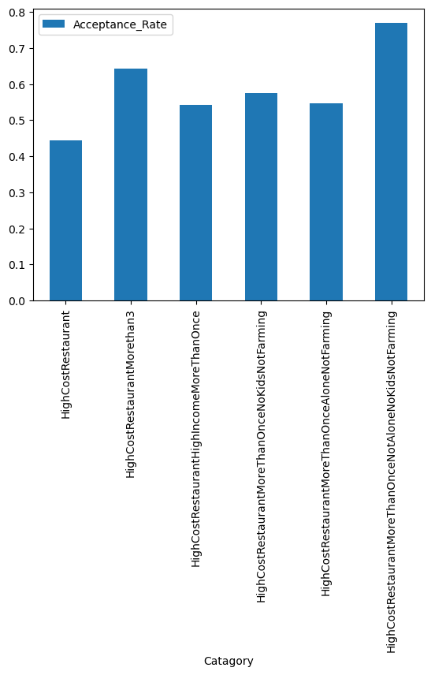

# CustomerCoupons
Python codebase to analyse customer coupon acceptance

I have analyzed the dataset collected via a survey on Amazon Mechanical Turk to find the acceptance rate of drivers who accepted coupons for  expensive restaurants on their way. Below is a short description of the data and what I have found as a result of the analysis.

**About the Data**

This data is from the UCI Machine Learning Repository and was collected via a survey on Amazon Mechanical Turk. The survey describes different driving scenarios, including the destination, current time, weather, and passenger, and then asks people whether they will accept the coupon if they are the driver. There are three possible answers people can choose from:
“Right away”
“Later, before the coupon expires”
“No, I do not want the coupon”
The first two responses are labeled as “Y = 1,” and the third is labeled as “Y = 0.” There are five different types of coupons: Less expensive restaurants (under 20), coffee houses, carryout and takeaway, bars, and more expensive restaurants (20–50).

**Analysis**

The code used for the analysis can be found [here](https://github.com/revathys/CustomerCoupons/blob/main/prompt.ipynb).
My findings have been mapped as a bar graph as seen below.

The above plot makes it very apparent that people who travel with a passenger but no kids, and are not working in the Farming Fishing & Forestry industry and who already visits high cost retaurants more than once a month tend to accept the coupons more(77%). They are folloed closely by people who goes to high cost restaurants more than 3 times a month(64%).
